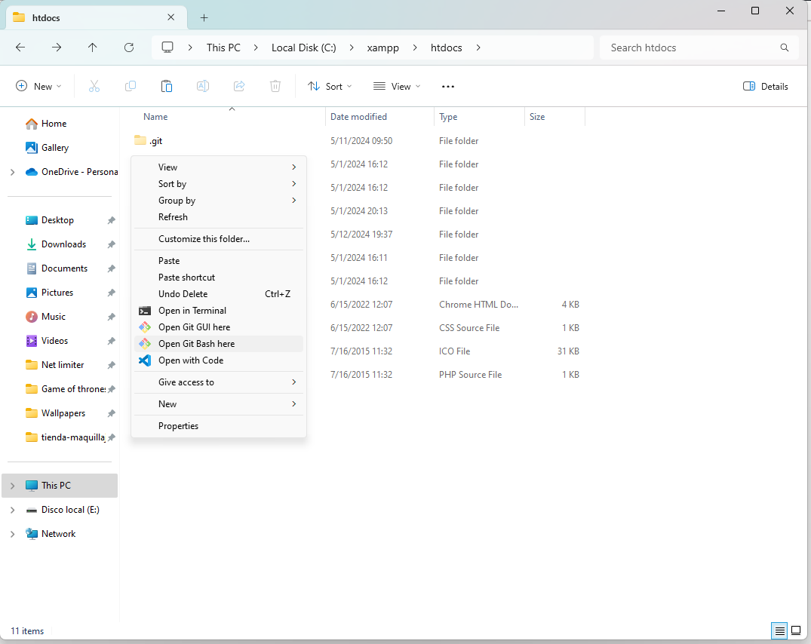
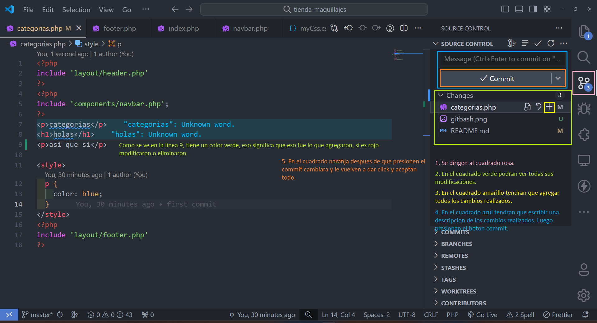

# TIENDA-MAQUILLAJES

Aqui agregan instrucciones

## Clonar Repositorio.

1. Irse a la ubicacion de su maquina donde quieran clonar (ejemplo: C:\xampp\htdocs)
2. Hacer click derecho y abrir git bash
   
3. ejecutar el siguiente comando

```bash
git clone https://github.com/JilmarAlmendras/tienda-maquillaje.git
```

## Configurar git.

1. Reemplaza "Nuevo Nombre" con tu nuevo nombre de usuario.

```bash
git config --global user.name "Nuevo Nombre"
```

2. Reemplaza "nuevoemail@example.com" con tu nueva dirección de correo electrónico.

```bash
git config --global user.email "nuevoemail@example.com"
```

## Antes de trabajar, utilizar el siguiente comando.

```bash
git pull origin master
```

## Despues de terminar de trabajar, hacer lo siguiente.

1. Leer los siguientes pasos.
   

## Para agregar una nueva tabla

Descargarse la extension de prisma.

1. Irse al archivo schema.prisma (presionar control+p y buscar schema).

2. Agregar la tabla en singular de esta esta forma.

```
model Cliente {
  idCliente     Int      @id @default(autoincrement())
  Nombre        String
  Email         String?
  Telefono      String?
  CreadoEn      DateTime @default(now())
  ActualizadoEn DateTime @updatedAt
}
```

3. Ejecutar el comando para migrar la base de datos.

```bash
npx prisma migrate dev --name init
```

4. Para bajar la base de datos de lo que agregaron los demas poner este codigo.

```bash
npx prisma migrate deploy
```
